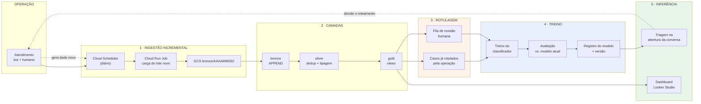

# O Ciclo de Aprendizado — Kenzie 360

**Projeto Kenzie 360 · Sprint 3 · 28/08/2026**
Responde à crítica do Prof. Gustavo: *"faltou o objetivo final"* e *"como será feito o processo de ML e aprendizado do robô"*.
Insumo para o redesenho da arquitetura (Jonathas).

---

## 1. Por que este documento existe

A arquitetura desenhada na Sprint 1 é um **cano de mão única**: o dado entra pela ingestão, atravessa bronze → silver → gold e sai no dashboard. Ela descreve corretamente um *pipeline analítico* — e é exatamente por isso que o professor não encontrou o objetivo final nela.

Um pipeline analítico produz relatórios. O que o projeto se propõe a construir é um sistema que **melhora com o uso**, e isso exige um caminho de volta que hoje não está desenhado em lugar nenhum.

> **A frase que fecha o escopo:** a Kenzie 360 é a camada de inteligência que transforma conversa em decisão. Ela é a fundação sobre a qual a V2 do bot será construída. O bot conversacional em si é o passo seguinte, fora do escopo deste semestre — e este projeto define o processo de aprendizado que vai alimentá-lo.

---

## 2. O que existe hoje, e o que falta

| Elemento | Estado |
|---|---|
| Ingestão de arquivo para o GCS | Existe |
| Bronze / silver / gold no BigQuery | Existe |
| Dashboard no Looker Studio | Existe (protótipo) |
| **Ingestão incremental** (só o que chegou desde ontem) | **Não existe** |
| **Orquestração** (algo que rode sozinho) | Decidido na Sprint 2, **não construído** |
| **Rotulagem de dados novos** | Não existe, nem no desenho |
| **Retreino do modelo** | Não existe, nem no desenho |
| **Caminho de volta para o atendimento** | Não existe, nem no desenho |

### 2.1 A boa notícia sobre o incremental

A camada silver **já está pronta para carga incremental** e ninguém percebeu. Ela deduplica por chave de negócio com `ROW_NUMBER() OVER (PARTITION BY chave ORDER BY _ingestion_ts DESC)` — ou seja, se o mesmo registro entrar duas vezes, a versão mais recente prevalece e a antiga é descartada.

O único bloqueio está na bronze, que carrega com `WRITE_TRUNCATE` (apaga tudo e recarrega). Trocar para `WRITE_APPEND`, mantendo o particionamento por `data_ref` e as colunas `_ingestion_ts` / `_source_file` que já existem, transforma a pipeline atual em incremental **sem reescrever a silver nem a gold**.

As views da gold não precisam de mudança nenhuma: views nunca ficam defasadas.

Isso é uma alteração pequena com um efeito grande na narrativa do projeto — sai de "carreguei um CSV" para "opero uma ingestão contínua".

---

## 3. O ciclo, em cinco estágios

**A seta pontilhada de volta é o documento inteiro.** É ela que separa um pipeline de um sistema que aprende, e é ela que responde à pergunta do professor.

### Estágio 1 — Ingestão incremental

Cloud Scheduler dispara um Cloud Run Job em horário fixo. O job identifica o lote ainda não processado, grava no GCS em `bronze/AAAAMMDD/` e carrega na bronze com `WRITE_APPEND`. As colunas `_ingestion_ts` e `_source_file` registram a procedência de cada linha.

*Por que Cloud Scheduler + Cloud Run e não Composer:* decisão da Sprint 2. O Composer custaria cerca de US$ 525/mês; esta combinação roda dentro do free tier.

### Estágio 2 — Camadas

Sem mudança estrutural. A silver deduplica pela chave de negócio e a gold são views, que refletem o dado novo automaticamente.

### Estágio 3 — Rotulagem *(o estágio que não existia)*

Um modelo supervisionado precisa de exemplos rotulados, e conversas novas chegam **sem rótulo**. Existem duas fontes:

- **Rótulo operacional:** casos em que a própria operação já registrou a informação no fluxo normal de trabalho. É rótulo de graça.
- **Revisão humana amostral:** uma fila em que um supervisor confirma ou corrige a previsão do modelo em uma amostra. É o que impede o modelo de envelhecer sem ninguém notar.

**Esta é a peça de maior valor para a aplicação no banco real** e a que mais costuma faltar em projetos de ML. Um modelo sem processo de rotulagem funciona no dia da entrega e degrada em silêncio depois.

### Estágio 4 — Treino

Treino sobre a base rotulada acumulada, avaliação contra o modelo em produção e registro da versão. Um modelo novo só substitui o anterior se for melhor na avaliação — caso contrário, o anterior permanece.

Gatilho de retreino: por volume de dado novo rotulado ou por queda de desempenho observada, não por calendário.

### Estágio 5 — Inferência e retorno

O modelo classifica a conversa na abertura e a informação vai para dois destinos:

- **Para a operação:** triagem em tempo real — a conversa entra na fila certa, com contexto, em vez de percorrer um caminho de bot que vai falhar.
- **Para o negócio:** o dashboard, com os padrões agregados.

E o atendimento resultante volta a ser dado de entrada. O ciclo fecha.

---

## 4. O que se constrói nesta entrega, e o que fica desenhado

Prazo real de desenvolvimento: até **07/09** (a Sprint 5 é revisão e apresentação).

| Estágio | Nesta entrega |
|---|---|
| 1 · Ingestão incremental | **Construir.** Escopo pequeno, alto valor de demonstração |
| 2 · Camadas | Já pronto |
| 3 · Rotulagem | **Desenhar** e demonstrar com os rótulos que a base já tem |
| 4 · Treino | **Construir** a versão inicial do classificador |
| 5 · Inferência | **Construir** em lote (batch). Tempo real fica desenhado |

**Streaming (Pub/Sub) permanece conceitual e declarado como tal.** Para o caso de uso, o incremental diário é o que importa; o streaming entra no desenho como evolução, não como entrega.

### Como demonstrar a ingestão incremental sem gerar base nova

A base v8 cobre 17/02 a 17/08. Basta **segurar a última semana** e carregá-la separadamente, como se fosse o lote que chegou depois. Demonstra o ciclo de ponta a ponta usando o que já existe, e é honesto — nada é apresentado como dado que não é.

---

## 5. Limitação a declarar

O ciclo é desenhado por inteiro e demonstrado sobre base sintética. **O aprendizado demonstrado é a recuperação de uma estrutura que a própria equipe escreveu**, não a descoberta de um padrão do cliente real.

O que a entrega demonstra com solidez é que o *processo* funciona ponta a ponta — ingestão, rotulagem, treino, inferência e retorno. É o processo, e não o modelo treinado, que transfere para a operação real.

---

## 6. Perguntas em aberto

1. Qual o gatilho de retreino, em números? (volume de rótulos novos ou queda de métrica)
2. Quem exerce o papel de revisor na fila de rotulagem, no desenho?
3. A inferência em lote roda no mesmo Cloud Run Job da ingestão ou em job separado?
